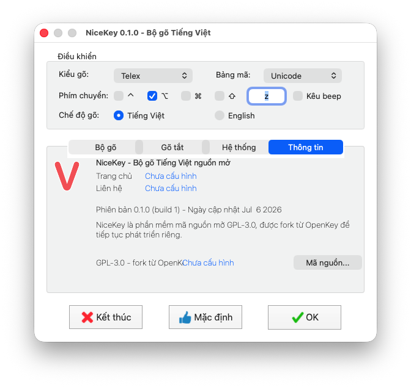
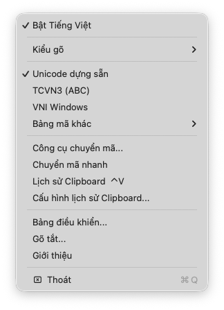

# NiceKey

[Tải cho macOS (.dmg)](https://github.com/klee3721/NiceKey/releases/download/v1.0.0/NiceKey-1.0.0.dmg) | [Tải cho Windows (.exe)](https://github.com/klee3721/NiceKey/releases/download/v1.1.0/NiceKey-1.1.0-Windows-Setup.exe)

NiceKey là bộ gõ tiếng Việt nguồn mở cho macOS và Windows, được phát triển từ nền tảng OpenKey. Mục tiêu của NiceKey là giữ lại phần lõi gõ tiếng Việt ổn định, nhẹ và quen thuộc, đồng thời tách thành một nhánh phát triển riêng với trải nghiệm cài đặt, nhận diện app và cấu hình phát hành rõ ràng hơn.

NiceKey vẫn tuân thủ GPL-3.0 và giữ đầy đủ ghi nhận đối với tác giả, contributor của OpenKey gốc.

Liên hệ phát triển: Telegram [@kienvu37](https://t.me/kienvu37)

## Demo

<p align="center">
  
</p>

<p align="center">
  
</p>

## Cải tiến so với OpenKey gốc

- Tách nhận diện thành NiceKey với bundle id riêng trên macOS, registry và executable riêng trên Windows, tránh lẫn với OpenKey khi cài đặt và phát triển tiếp.
- Làm lại luồng cấp quyền lần đầu: app chỉ mở bảng cấp quyền Accessibility, sau khi người dùng cấp quyền sẽ thông báo, tự thoát và mở lại để kích hoạt bộ gõ sạch từ đầu.
- Bổ sung lịch sử Clipboard trên cả macOS và Windows, có popup tìm kiếm, ảnh xem trước, điều hướng bàn phím, cấu hình phím tắt và giới hạn 30 mục gần nhất.
- Bổ sung danh sách loại trừ thủ công trên Windows: ứng dụng đã chọn luôn nhận phím tiếng Anh mà không làm thay đổi chế độ Việt/Anh chung.
- Dọn lại phần giới thiệu, liên hệ, release và thông tin giấy phép cho nhánh NiceKey.
- Đóng gói DMG kéo thả cho macOS và bộ cài theo người dùng cho Windows 10/11.
- Tắt các liên kết cá nhân/donation của dự án gốc trong tài liệu chính, đồng thời vẫn giữ giấy phép và ghi nhận nguồn mở đầy đủ.

## Cài đặt macOS

Tải file DMG mới nhất:

[NiceKey-1.0.0.dmg](https://github.com/klee3721/NiceKey/releases/download/v1.0.0/NiceKey-1.0.0.dmg)

Mở file `.dmg`, kéo `NiceKey.app` vào thư mục `Applications`, sau đó mở NiceKey từ Applications.

## Cài đặt Windows

Tải [NiceKey-1.1.0-Windows-Setup.exe](https://github.com/klee3721/NiceKey/releases/download/v1.1.0/NiceKey-1.1.0-Windows-Setup.exe), mở bộ cài và chọn `Mở NiceKey` sau khi hoàn tất. Bản cài hỗ trợ Windows 10 phiên bản 1809 trở lên và Windows 11, tự chọn executable x64 hoặc x86 phù hợp.

Phím chuyển chế độ Việt/Anh mặc định là `Ctrl+Shift`. Người dùng có thể chọn hai hay nhiều phím bổ trợ và để trống ô phím chính để dùng chính tổ hợp đó.

Để buộc một ứng dụng luôn gõ tiếng Anh, bật `Loại trừ ứng dụng thủ công`, mở tab `Loại trừ`, chọn ứng dụng đang chạy rồi bấm `Thêm`. Bấm `Bỏ` hoặc nhấp đúp ứng dụng ở danh sách phía trên để xóa khỏi danh sách loại trừ.

Trong menu biểu tượng NiceKey ở khay hệ thống, chọn `Lịch sử Clipboard` để mở danh sách hoặc `Cài đặt Clipboard...` để đổi phím tắt. Phím mở lịch sử Clipboard mặc định là `Ctrl+Shift+V`.

## Build macOS

Mở project bằng Xcode:

```bash
open Sources/OpenKey/macOS/OpenKey.xcodeproj
```

Hoặc build từ terminal:

```bash
xcodebuild -project Sources/OpenKey/macOS/OpenKey.xcodeproj -scheme NiceKey -configuration Debug build
```

Nếu build trên máy chưa cấu hình signing, có thể dùng:

```bash
xcodebuild -project Sources/OpenKey/macOS/OpenKey.xcodeproj -scheme NiceKey -configuration Debug CODE_SIGNING_ALLOWED=NO build
```

## Build Windows

Mở solution `Sources/OpenKey/win32/OpenKey/NiceKey.sln` bằng Visual Studio 2022 và build cấu hình `Release` cho `x64` hoặc `x86`. Workflow `Windows build` cũng build, chạy self-test và tạo cả installer lẫn bản portable.

## Cấp quyền macOS

NiceKey cần quyền Accessibility để bắt và xử lý phím. Lần đầu mở app, NiceKey sẽ chỉ hiển thị bảng cấp quyền. Sau khi cấp quyền, app sẽ thông báo, tự thoát và mở lại để kích hoạt bộ gõ.

## Giấy phép và ghi nhận

NiceKey tiếp tục phát hành theo GPL-3.0. Xem [LICENSE](LICENSE) và [NOTICE.md](NOTICE.md).

Source gốc là OpenKey. Các copyright notice của tác giả gốc và contributor vẫn được giữ trong source để tuân thủ giấy phép nguồn mở.
